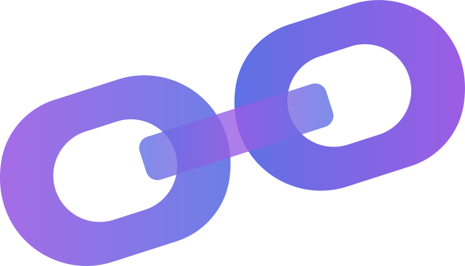

      
  <h1 align="center">
    ThatsAShort.link
  </h1>

<h3 align="center">
  A self-hosted MongoDB based URL Shortener
</h3>

<h3 align="center">
        
      
      
      
</h3>

<h3 align="center">
      Progress: 
      
</h3>

# ⚙️ Installation
## Before installing
Make sure you have Node, npm and MongoDB installed. Depending on which Webserver you use or how you have it configured you might need to configure it as a Reverse Proxy.

## **Using a precompiled Verison: (recommended)**
  - Download newest Version from the ** Releases Tab ** and Upload it to your Server
  - Enter the Directory you've saved the Project in and install all the Dependencies using `npm install`.
  - Open the config.json file and enter a Username, Password and secretKey. (The Secret Key will be used to generate your Login Token.)
  - Start the server using `npm run` or another Process manager like [PM2](https://pm2.keymetrics.io/)

  That's it. TASL is installed. Check your Server IP using Port 3000. You should be redirect to http://YOUR-IP:3000/admin/login where you can login with the Username and Password you created in Step 3.

## **Compiling yourself (not recommended)**
Use this only if you want change something about TASL and you have experience with Node & Angular. You should install [Angular CLI](https://cli.angular.io/)!
- Download the Repository and enter the Direcotry you've saved the Project in.
  - The folder **Frontend** will contain everything Angular and the folder **Backend** will contain the Node Backend
  - Replace `readonly ROOT_URL = "http://localhost:3000/TASL"` with `readonly ROOT_URL = document.location.origin + "/TASL"` in /src/app/info-card.component.ts
  - Replace `readonly ROOT_URL = "http://localhost:3000/TASL"` with `readonly ROOT_URL = document.location.origin + "/TASL"` in /src/app/login.component.ts
  - Replace `readonly ROOT_URL = "http://localhost:3000/TASL"` with `readonly ROOT_URL = document.location.origin + "/TASL"` in /src/app/newshort.component.ts
  - Replace `readonly ROOT_URL = "http://localhost:3000/TASL"` with `readonly ROOT_URL = document.location.origin + "/TASL"` in /src/app/infourllist.component.ts
  - Enter the folder **Frontend** and type into a Termianl Window `npm run production`
  - After this process has finished open the directory **Backend**. A new folder containing the compiled front end should now have appeard
  - Open the config.json file and enter a Username, Password and secretKey. (The Secret Key will be used to generate your Login Token.)
  - Upload the folder **Backend** to your server and enter the direcotry.
  - Start the server using `npm run` or another Process manager like [PM2](https://pm2.keymetrics.io/)

  That's it. TASL is installed. Check your Server IP using Port 3000. You should be redirect to http://YOUR-IP:3000/admin/login where you can login with the Username and Password you created in Step 3.

# 📙 Usage
Comming Soon(tm)

# 🤔 FAQ

Help! It's not starting. I get a `MongooseServerSelectonError: connect ECONNREFUSED 127.0.0.1:27017` Error.
> Check if you have MogoDB installed. Download it [here](https://www.mongodb.com/download-center/community)
